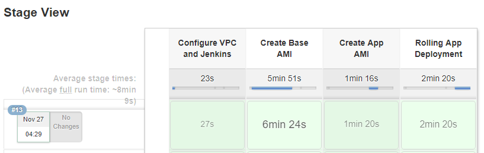

# A simple example of immutable infrastructure
A Node.js application and MongoDB database deployed using Packer and Terraform on AWS. See this [CloudCraft diagram](https://cloudcraft.co/view/ef83c3de-abfe-42eb-acee-d96cad91dc55?key=vtzk8z9G_7mL8xxDLiciQA) for a visual view of the app.

## About the app
The backend and routing are contained in the [server.js](server.js) file, and the AngularJS front end is contained in the [public/](public/) directory. This sample app was pulled from the [Node Todo](https://github.com/scotch-io/node-todo) project from Scotch.io. Our single table "Todo" will be stored in a MongoDB database. The service is divided into 2 layers, app and data.

## Infrastructure - app layer
The app layer infrastructure is immutable. To quote Florian Motlik from CodeShip, "Immutable infrastructure is comprised of immutable components that are replaced for every deployment, rather than being updated in-place." [(Source)](https://blog.codeship.com/immutable-infrastructure/). This allows us to avoid configuration drift, memory leaks, unpatched instances, and the dreaded reboot of an instance with 439 days of uptime at 2 in the morning. The app layer will be deployed using Terraform with a single Elastic Load Balancer and an Auto-Scaling Group of EC2 instances. The instance AMIs are built using Packer.

## Infrastructure - DB layer
The MongoDB instance is launched into an auto-scaling group. The MongoDB data itself is stored in a mutable EBS volume. This volume is attached to the MongoDB server on boot with a user data script. This allows the MongoDB server to be deleted and re-launched automatically without losing the application state.

## Build
To build the infrastructure, clone the GitHub repo, give Terraform some credentials [(see Terraform docs)](https://www.terraform.io/docs/providers/aws/), download and install [Terragrunt](https://github.com/gruntwork-io/terragrunt/releases) for remote state management, then run:

```
cd terraform/<app>
terragrunt apply
```

Terragrunt will take care of creating S3 buckets and initializing your remote state automatically.

Once the network configuration is deployed and Jenkins is configured, we can use Packer to create AMIs through a Jenkins job. I used Nicolás Bevacqua's excellent tutorial ["Immutable Deployments and Packer"](https://ponyfoo.com/articles/immutable-deployments-packer) as an example, and modified to use the amazon-chroot builder for a performance boost. It requires some funky sudo action to allow Jenkins to mount volumes, but it knocks precious minutes off our build time.

AMI images are best built in layers, so when it comes time to deploy, we have the option to use a hardened base image instead of building from scratch. To make the base AMI, we'll use Packer to update all OS packages to the latest version, configure swap space, and copy an init conf file to the image:

```
sudo -H -u ubuntu bash -c 'sudo packer build packer/base.json | tee /tmp/base.log'

BASE_AMI=$(tail -2 < /tmp/base.log | grep ami | cut -d ' ' -f 2)
echo $BASE_AMI >> /tmp/base_ami
```

## Deploy
After the base image has been created, the deploy image can be built very quickly. The steps are similar to the base image:

```
sudo -H -u ubuntu /bin/bash -c 'sudo packer build -var SOURCE_AMI=$(tail -1 /tmp/base_ami) packer/app.json | tee /tmp/app.log'

APP_AMI=$(tail -2 < /tmp/app.log | grep ami | cut -d ' ' -f 2)
echo $APP_AMI >> /tmp/app_ami
```

The app AMI can then be used to deploy our immutable application layer. We can assign the app AMI ID to a "TF_VAR" environment variable so Terraform will recognize it. To test our configuration and apply it, accepting all prompts to initialize remote state, use this code in a Jenkins job:

```
cd terraform/services/app
export TF_VAR_source_ami=$(tail -1 /tmp/app_ami)
terragrunt plan --terragrunt-non-interactive -out=tf.out && terragrunt apply --terragrunt-non-interactive tf.out
```

Running `terraform apply` for the first time will launch a new ELB and auto-scaling group. When the AMI ID is modified and `terraform apply` is run again, the auto-scaling launch configuration will change, forcing a new auto-scaling group to be provisioned by updating its `name` parameter. Lifecycle management of the current auto-scaling group in [terraform/services/app/main.tf](terraform/services/app/main.tf) prevents Terraform from deleting the old auto-scaling group until the new instances have been launched and passed their health checks. With these simple options, it is trivial to perform rolling deployments of asynchronous services using Terraform and auto-scaling groups.

## Putting it all together
Once you have your Jenkins jobs created, a Pipeline can be used to vizualize your deployment flow. Here is a simple example of a Pipeline job configuration:

```
stage('Configure VPC and Jenkins') {
    build 'terraform-vpc'
    build 'terraform-services-jenkins'
}
stage('Create Base AMI') {
    build 'packer-build-base'
}
stage('Create App AMI') {
    build 'packer-build-app'
}
stage('Rolling App Deployment') {
    build 'terraform-services-app'
}
```



To update the app code, only the last two stages need to be executed, which means our new code takes under 4 minutes to hit production. Not bad!

For additional performance gains, more AMI layers can be added with Packer to cache other operations that don't need to be performed every day, such as updating versions for app requirements.

## Troubleshooting
You may run into this error using terragrunt:

```
1 error(s) occurred:

* provider.aws: no suitable version installed
  version requirements: "(any version)"
  versions installed: none
```

If this occurs, you can fix it by wiping out the Jenkins job workspace and running the job again, or by deleting the .terraform directory if you are running terragrunt locally.

## Todo
* Store and manage AMI image IDs in a way that allows changes to be rolled back easily
* Testing of AMI images before deployment using [Goss](https://github.com/aelsabbahy/goss)
* Immutable Mongo replset
* Automatic cleanup of AMIs (these can get quite expensive)
* Jenkinsfile integration for Pipeline
